## Cinema Book System

### part 1
1.to do so we need to create an applicationcontext file and set the beans acording to the diagram provided, then we can create a main class and 
bind the project with the application context:  
the applicationContext file:  
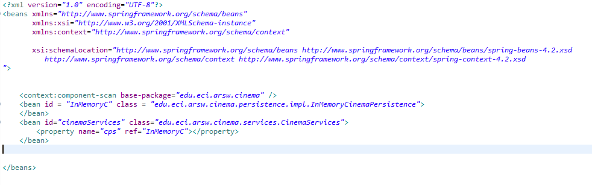  

2.the modifications can be found on the respective files. and the tests also can be found on the folder.  
 4.we can found the everything is working using the tests.  
5.first we need to implement the filter interface:  
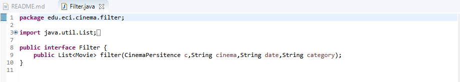  
  
then we implement each filter:  
availability:  
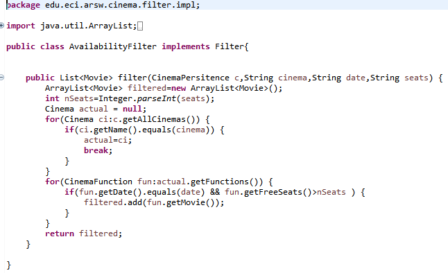  
  
Gender:  
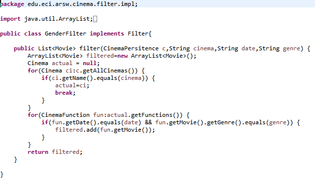  

after that, we can modify the application context in order to bind the filter interface to one of the filters defined:  
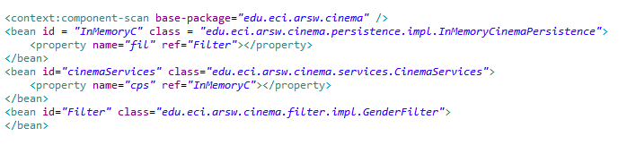  
finally we set the annotation on the cinema persistence implementation taking into account we will inject a filter:  
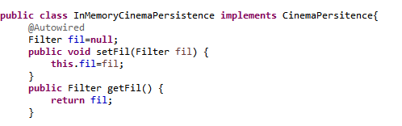  
finally on the main we can test each filter:  
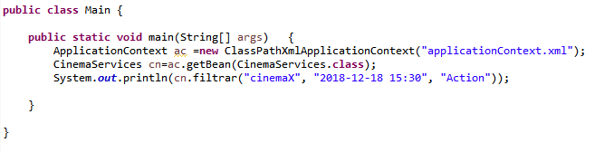  
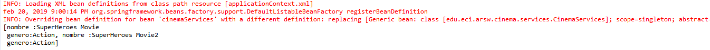  
then we modify the annotation and test again:  
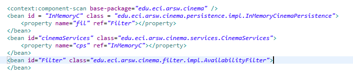  
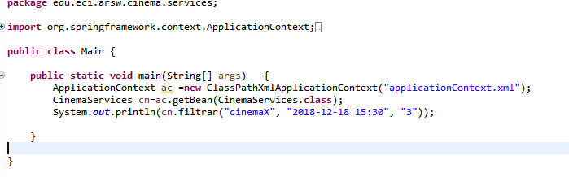  
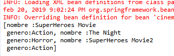  